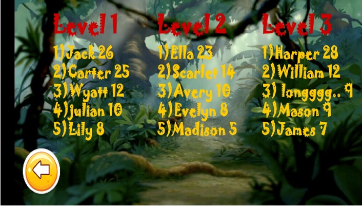
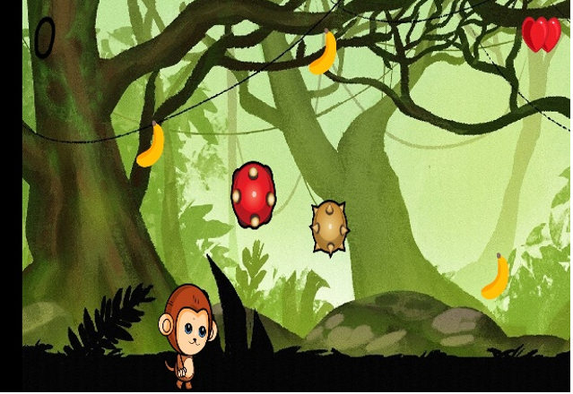

# Banana Monkey
Banana Monkey is an android game developed as part of a university assignment in my second year.
I used the libGDX framework in order to create the game.

## Game Description
The game consists of three different levels. In each level, the task is the same gather as many 
bananas as you can while avoiding the objects coming your way. Each level, however, is more 
complicated than the previous one as the objects are becoming more dangerous and challenging to avoid.
  

The game also has an online high score system. The top five of each level can be seen, 
and if the player manages to score higher than one of the top five players, he gets to be in the high scoreboard.
  

Lastly, the control of the monkey is straightforward. One tap on the top quarter of the screen 
for one jump, press the left quarter of the screen to go left, and the right quarter to go right. 
The player has three lives and if the player loses all of them is game over

## User Interface

